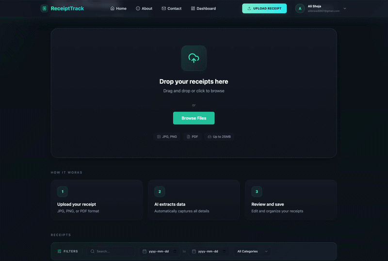
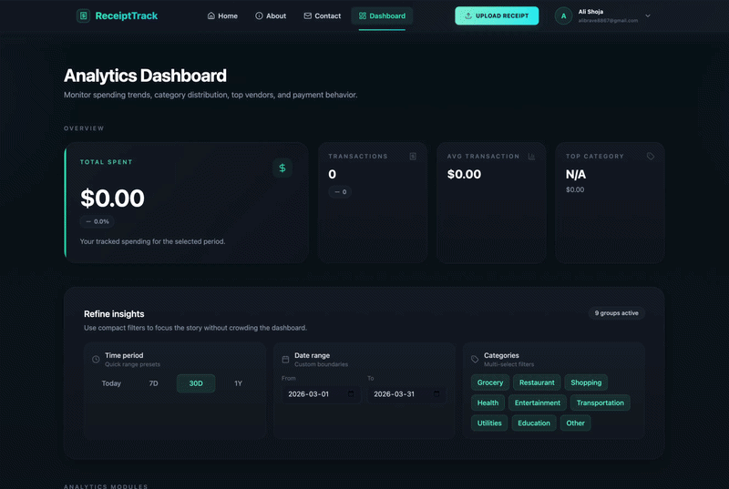

# ReceiptTrack

**Turn paper receipts into actionable financial insights — automatically.**

ReceiptTrack solves a common problem: manually tracking expenses is tedious, error-prone, and time-consuming. Instead of typing every purchase into a spreadsheet, you upload a photo of your receipt and let **AI extract, categorize, and visualize** everything for you.

Built as a full-stack production-grade application with **React**, **NestJS**, **PostgreSQL**, and **AI integrations** (OCR + LLM).

**[Live Demo](https://receipts-tracker.up.railway.app/)**

---

## Why This Project Matters

Most expense tracking apps require manual input, which leads to poor adoption and incomplete data.

ReceiptTrack removes friction by automating the entire process — from receipt upload to structured insights — making personal finance tracking effortless.

---

## Product Demo

### Upload & AI Processing

Upload a receipt image and watch AI automatically extract the store name, date, total amount, and category — all in seconds.



### Dashboard & Analytics

Visualize your spending with an interactive dashboard featuring real-time charts, category breakdowns, and trend analysis.



---

## Features

### Core

- **AI-powered receipt extraction** — OCR reads the receipt, LLM structures the data into clean JSON
- **Automated categorization** — expenses are auto-tagged (Grocery, Health, Transport, etc.)
- **Real-time expense dashboard** — track spending trends, totals, and breakdowns at a glance
- **Smart search & filters** — find any receipt by store, date range, category, or payment method

### Frontend

- **Interactive charts** — bar charts, pie charts, and spending-over-time visualizations (Recharts)
- **Modern dark UI** — glassmorphism design system with teal/cyan accents
- **Responsive** — works on desktop, tablet, and mobile
- **Component-based architecture** — clean separation of concerns with reusable components

### Backend

- **RESTful API** — well-structured NestJS modules with DTOs, guards, and services
- **Google OAuth** — secure authentication with JWT access/refresh tokens
- **Database migrations** — TypeORM with versioned schema changes
- **File processing pipeline** — upload → OCR → LLM parsing → database storage

---

## Architecture

```
Receipt Image → Google Cloud Vision (OCR) → OpenAI (LLM Parsing) → PostgreSQL → Dashboard
```

The pipeline works in three stages:

1. **OCR** — extracts raw text from the receipt image using Google Cloud Vision
2. **LLM** — sends the raw text to OpenAI to structure it into JSON (store, date, amount, category)
3. **Storage & Display** — saves structured data to PostgreSQL, renders it in the React dashboard

---

## Tech Stack

| Layer | Technologies |
|-------|-------------|
| **Frontend** | React 19, TypeScript, Vite, Tailwind CSS, React Query, Zustand, Recharts |
| **Backend** | NestJS, TypeORM, PostgreSQL, Passport (JWT + Google OAuth) |
| **AI Services** | Google Cloud Vision API (OCR), OpenAI API (LLM) |
| **DevOps** | Docker, Docker Compose, Husky, Prettier, ESLint |

---

## Quick Start

### With Docker (Recommended)

```bash
git clone https://github.com/alishoja88/receipt-tracker.git
cd receipt-tracker

# Set up environment variables
cp receipt-tracker-backend/.env.example receipt-tracker-backend/.env
# Add your API keys to .env

# Start everything
make up
```

### Without Docker

```bash
make install

# Start PostgreSQL
docker-compose -f docker-compose.dev.yml up -d postgres

# Terminal 1: Backend
make dev-backend

# Terminal 2: Frontend
make dev-frontend
```

### Access

| Service | URL |
|---------|-----|
| Frontend | http://localhost:5173 |
| Backend API | http://localhost:3000 |
| PostgreSQL | localhost:5432 |

---

## Environment Variables

Create `.env` in `receipt-tracker-backend/`:

```env
DATABASE_URL=postgres://user@localhost:5432/receipts_db

# Google Cloud Vision (OCR)
OCR_API_KEY=your-google-cloud-vision-api-key
OCR_API_ENDPOINT=https://vision.googleapis.com/v1/images:annotate

# OpenAI (LLM)
OPENAI_API_KEY=your-openai-api-key

# Server
PORT=3000
NODE_ENV=development
```

---

## Project Structure

```
receipt-tracker/
├── receipt-tracker-backend/        # NestJS API
│   └── src/
│       ├── modules/auth/           # Google OAuth + JWT
│       ├── modules/receipts/       # Receipt CRUD + processing
│       ├── modules/ai/             # OCR + LLM services
│       ├── modules/expenses/       # Analytics & summaries
│       └── migrations/             # Database schema versions
│
├── receipt-tracker-frontend/       # React SPA
│   └── src/
│       ├── pages/                  # Route-level pages
│       ├── components/             # Shared UI components
│       ├── modules/                # Feature modules (receipts, auth, expenses)
│       └── store/                  # Zustand state management
│
├── docker-compose.yml              # Production
├── docker-compose.dev.yml          # Development
└── Makefile                        # Project commands
```

---

## Useful Commands

```bash
make help            # Show all available commands
make up              # Start development environment
make down            # Stop everything
make logs            # View logs
make format          # Format all code
make db-reset        # Reset database
make test            # Run backend tests
make test-frontend   # Run frontend tests
```

---

## About Me

I'm Ali — a front-end focused developer specializing in React and TypeScript.

I built ReceiptTrack to solve a real problem: tracking expenses without manual data entry. This project reflects my approach to building software — clean UI, practical architecture, and meaningful user experience.

This project reflects how I think about building software — clean code, thoughtful UX, and practical AI integration. It's not just a demo; it's a working product I designed, built, and deployed end-to-end.

- [LinkedIn](https://www.linkedin.com/in/alias-shoja/)
- [GitHub](https://github.com/alishoja88)

---

## License

This project is built for educational and demonstration purposes.
